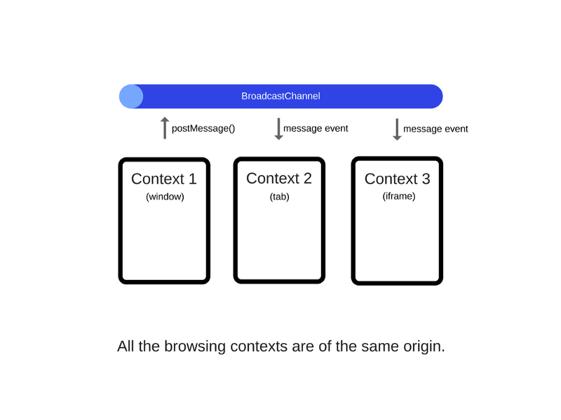

# (HJW) 5. webworker

## 비동기 함수의 한계

- 만약 비동기 콜백 안에 오래 걸리는 작업이 있다면(엄청 큰 for loop 같이) 이벤트 루프를 해제하고 UI 랜더링을 하게 만드는 방법이 없을까?
- 몇몇 경우에서는 작업을 setTimeout으로 분리해 이벤트 루프 넣어 중간 중간 렌더링 할 시간을 벌어 주도록 트릭을 쓸 수 있었다.

## web worker

- 웹 워커 또한 HTML5의 기능이다.
  - SSE
  - Geolocation
  - Application cache
  - Local Storage
  - Drag and Drop
  - Web Workers
- 웹 워커는 이벤트 루프 막힘 없이 코드를 실행 할 수 있도록 브라우저 안에 있는 스레드이다.
- 시간이 오래 걸리고 계산이 많이 요구되는 작업을 할 수 있게 해준다.
- 웹 워커는 자바스크립트의 기능이 아닌 브라우저의 기능이다.
- 노드js에서는 웹워커가 구현되지 않았고 `cluster, child_process`라는 개념이 있다.
- 웹 워커의 타입은 Dedicated Workers, Shared Workers, Service workers가 있다.

## web worker type

- Dedicated Workers : 메인 프로세스에 의해서 인스턴스화 되고 커뮤니케이션 할 수 있다.
- Shared Workers : 서로 다른 윈도우, 아이프레임, 다른 워커간에 접근 할 수 있고 포트 객체를 통해 커뮤니케이션 할 수 있다.
- Service Workers : 원하는 페이지에 이벤트를 등록해서 프록시 처럼 웹페이지나 사이트를 컨트롤 할 수 있다. (Push Notifications, Cache, dominate Network Traffic)

## Dedicated web worker 구현

- 웹 워커는 .js 파일로 http request에 포함 되어 있는데 web worker api로 리퀘스트를 숨길 수 있다.
- 브라우저의 독립적인 스레드로 분리된 파일에서 실행되야 한다.

``` js
var worker = new Worker('task.js');
```

- task.js에 접근하면 브라우저는 새 스레드를 생성하고 파일을 비동기로 다운로드 한다.
- 다운로드가 완료 되면 실행되면서 워커가 시작된다.

``` js
worker.postMessage();
```

- 웹워커와 페이지가 통신하기 위해서 `postMessage()`메소드나 `BroadcastChannel()`이 필요하다.
- 최신 브라우저는 `JSON`을 파라미터로 써도 되지만 오래된 브라우저는 `string`만 지원한다.

### `postMessage()`를 이용한 방법

```html
<button onclick="startComputation()">Start computation</button>

<script>
  function startComputation() {
    worker.postMessage({'cmd': 'average', 'data': [1, 2, 3, 4]});
  }
  var worker = new Worker('doWork.js');
  worker.addEventListener('message', function(e) {
    console.log(e.data);
  }, false);
  
</script>
```

- doWork.js

```js
self.addEventListener('message', function(e) {
  var data = e.data;
  switch (data.cmd) {
    case 'average':
      var result = calculateAverage(data); // Some function that calculates the average from the numeric array.
      self.postMessage(result);
      break;
    default:
      self.postMessage('Unknown command');
  }
}, false);
```

- `self`, `this`는 글로벌 스코프를 참조한다.
- 워커를 멈추기 위해서는 `worker.terminate()`, `self.close()`

### `BroadcastChannel()`를 이용한 방법

- Broadcast Channel는 더 일반적인 API이다.
- 모든 탭, 아이프레임, 같은 브라우저에서 커뮤니케이션이 가능하다.

``` js
var bc = new BroadcastChannel('test_channel');

// Example of sending of a simple message
bc.postMessage('This is a test message.');

// Example of a simple event handler that only
// logs the message to the console
bc.onmessage = function (e) { 
  console.log(e.data); 
}

// Disconnect the channel
bc.close()
```



## reference

- [How JavaScript works: The building blocks of Web Workers + 5 cases when you should use them](https://blog.sessionstack.com/how-javascript-works-the-building-blocks-of-web-workers-5-cases-when-you-should-use-them-a547c0757f6a)