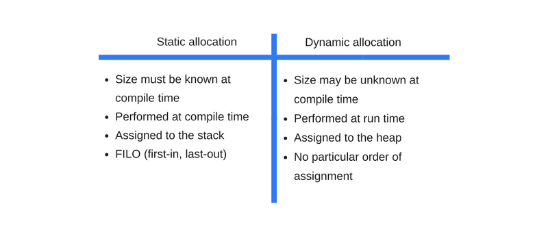
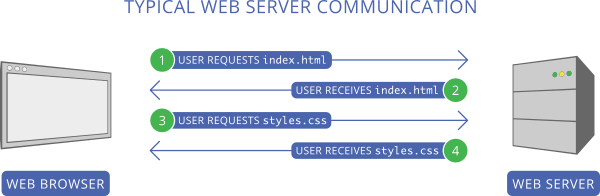
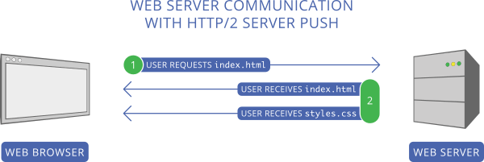
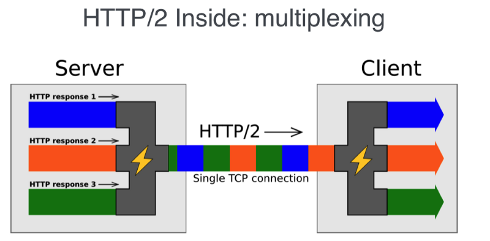

# How javascript work

## 브라우저의 구성과 역할

### 브라우저 구성


- WebAPI : 비동기 호출(`setTimeout`, `XMLHttpRequest`)과 `DOM`과 같은 기능을 제공한다.
- 이벤트루프와 태스트큐 : 엔진 외부에 구현되어 있고 비동기 방식으로 동시성을 제공한다.
- javascript 엔진 : 메모리 힙과 콜스택으로 구성된다.

### Node.js 구성


- api 콜백을 LIBUV(node.js 비동기 IO 라이브러리)가 지원하는 이벤트 루프에서 처리한다.

### 브라우저 엔진


- Mozilla Firefox : Spidermonkey
- Microsoft Edge : Chakra / ChakraCore
- Apple Safari : JavaScriptCore
- Google 크롬, Node.js : V8

---

- 메모리힙과 콜스택으로 구성된다.
- 콜스택 : 함수를 호출 할 때 함수의 arguments 와 지역변수로 구성된 `스택 프레임`을 생성해서 스택에 쌓고 컴파일 시 실행된다.  
  스택은 stack overflow가 발생 할 수 있고 에러가 발생하면 stack trace(현재 스택 추적 `console.trace`)를 할 수 있다.
- 메모리 힙 : 동적으로 메모리를 할당해야 하는 경우는 구조화 되지 않은 공간인 Heap에 할당 되어 런타임에 실행 된다.(object, string)

### V8

- 속도를 높히기 위해 인터프린터 대신 JIT(just in time) 컴파일러를 구현해 놓아서 javascript 코드 실행 시에 byte코드나 중간코드를 구현하지 않고 기계코드로 직접 컴파일 한다.
- 두가지 컴파일러
  - full-codegen : 간단하고 빠른 컴파일러
  - Crankshaft : 복잡하고 최적화하는 컴파일러
- 내부적으로 여러 스레드를 사용한다.
  - 코드를 가져와 컴파일하고 실행하는 주 스레드.
  - 컴파일을 위한 스레드
  - 런타임에게 어떤 메소드에 시간을 많이 쓸지 알려주는 프로파일러 쓰레드
  - 가비지콜렉터를 다루는 스레드
- 코드를 실행하면 full-codegen가 바로 기계코드로 변환하고  
  프로파일러 스레드는 메소드에게 최적화 된 데이터들을 모은다.  
- Crankshaft는 다른 스레드에서 실행되며  
    자바스크립트 abstract syntax tree를 static single-assignment 정적 단일 할당 (SSA) 으로 불리는 Hydrogen 로 변환하고 (SSA는 컴파일러 안에서 중간언어로 사용된다)
    인라이닝, Hydrogen graph 최적화를 한 후 기계어로 변환한다.
- [Crankshaft](https://wingolog.org/archives/2011/08/02/a-closer-look-at-crankshaft-v8s-optimizing-compiler)

### hidden class

- 자바스크립트는 동적타이핑 언어이다. 컴파일시 메모리 오프셋을 결정 할 수 없으며 코드를 실행 할 때(런타임) 상황에 따라서 데이터 타입이 정해진다.
- 이 같은 이유로 객체 프로퍼티를 접근 할 때 마다 사전 같은 구조에서 속성를 찾아야 하고 이를 위한 동적 탐색(dynamic lookup)을 하게 되는데 이 과정에서 구현 방식에 따라 비용이 달라진다.
- V8은 hidden class를 사용해서 프로퍼티의 오프셋을 가지고 값을 업데이트 하면서 dynamic lookup을 회피하고 있다.
- [동작과정](https://engineering.linecorp.com/ko/blog/v8-hidden-class/)
- 속성을 참조하는 순서에 따라 다른 히든클래스가 생성되기 때문에 같은 순서로 초기화 하는것이 좋다.
- 객체를 초기화 할 때 사용하는 모든 속성을 할당하는것이 좋다. 추가로 할 당하면 히든 클래스가 변하기 때문에

### 인라인캐싱

- 메소드가 호출 될 때마다 객체의 히든클래스를 찾아서 오프셋값을 계산해야하기 때문에 이것을 캐싱처리 한다.
- 두번의 호출에서 한 메소드에서 같은 객체에 접근했다면 그 객체의 히든클래스를 참조하는 것을 건너 뛰고 스스로 해당 메소드 객체 포인터 속성에 오프셋을 저장해 놓는다.
- 값을 접근하는 순서에 따라 히든클래스가 달라지기 때문에 캐싱을 사용하지 못하는 경우가 있다.

### 이벤트 루프와 테스트 큐

- 모든 비동기 함수는 콜백 함수를 태스크 큐에 추가한다.
- 이벤트 루프는 '현재 실행중인 태스크가 없을 때'(주로 호출 스택이 비워졌을 때) 태스크 큐의 첫 번째 태스크를 꺼내와 실행한다.
- [데모 코드](http://latentflip.com/loupe/?code=JC5vbignYnV0dG9uJywgJ2NsaWNrJywgZnVuY3Rpb24gb25DbGljaygpIHsKICAgIHNldFRpbWVvdXQoZnVuY3Rpb24gdGltZXIoKSB7CiAgICAgICAgY29uc29sZS5sb2coJ1lvdSBjbGlja2VkIHRoZSBidXR0b24hJyk7ICAgIAogICAgfSwgMjAwMCk7Cn0pOwoKY29uc29sZS5sb2coIkhpISIpOwoKc2V0VGltZW91dChmdW5jdGlvbiB0aW1lb3V0KCkgewogICAgY29uc29sZS5sb2coIkNsaWNrIHRoZSBidXR0b24hIik7Cn0sIDUwMDApOwoKY29uc29sZS5sb2coIldlbGNvbWUgdG8gbG91cGUuIik7!!!PGJ1dHRvbj5DbGljayBtZSE8L2J1dHRvbj4%3D)

```js
while(queue.waitForMessage()){
  queue.processNextMessage();
}
```

- A 콜백이 큐에서 제거되고 B 콜백이 실행 될때 B에서 에러가 발생하므로 A콜백에 있는 try-catch 문에 잡히지 않는다.

```js
$('.btn').click(function() { // (A)
    try {
        $.getJSON('/api/members', function (res) { // (B)
            // 에러 발생 코드
        });
    } catch (e) {
        console.log('Error : ' + e.message);
    }
});
```

- 태스크 큐 작업이 끝나는 시점에 랜더링이 되기 때문에 하나의 콜백 안에 랜더링이 변하는 로직을 넣으면 생각처럼 작동 하지 않는다.
- 태스크 큐에 `setTimeout`로 작업을 분리해서 넣거나 `setImmediate`이나 `nextTick` 으로 해결 할 수 있다.

```js
$('.btn').click(function() {
    showWaitingMessage();
    longTakingProcess();
    hideWaitingMessage();
    showResult();
});

$('.btn').click(function() {
    showWaitingMessage();
    setTimeout(function() {
        longTakingProcess();
        hideWaitingMessage();
        showResult();
    }, 0);
});
```

### Zero delays

- `setTimeout(fn, 0)` 은 실제로 주어지 시간 뒤에 함수를 실행 하지 않는다.
- `setTimeout`에 대한 특정 시간 제한을 지정 했더라도 대기중인 메시지의 모든 코드가 완료 될 때까지 대기해야 한다.

### 마이크로테스크

- 프로미스는 마이크로테스크로 등록 되는데 이는 일반 태스크큐 보다 높은 우선순위를 지닌 테스크이다.

### Job Queue

- es6에서 도입 됐으며 Promises 에서 쓰임. 마이크로테스크와는 별도의 개념.
- 함수 안에서 프로미스가 리졸브 됐다면 그 함수가 끝나자 마자 바로 실행 된다.
- 현재 call stack이 비워졌을때 job이 실행이 되고 다른 잡이 끼어들지 못한다
- [참조](https://flaviocopes.com/javascript-event-loop/#es6-job-queue)
- [참조](http://www.ecma-international.org/ecma-262/6.0/#sec-jobs-and-job-queues)

---

## 메모리 할당

1. allocate : 프로그램이 사용할 수 있도록 운영체제가 메모리는 할당
2. use : 코드 상에서 할당 된 변수를 사용함으로써 메모리에 읽기와 쓰기 작업을 한다.
3. release : 필요 없는 자원을 해제한다.

### 정적 할당

- 코드를 컴파일하며 컴파일러는 필요한 메모리를 계산해 `stack space` 라는 곳에서 프로그램을 할당 한다.
- 함수에서 함수를 부를 때 함수 각 각 불려지는 시점에 자신의 로컬 변수를 포함하는 스택청크를 가지게 되고  
 실행중인 부분을 프로그램 카운터가 기억한다. 그리고 함수가 끝나면 이 메모리 블럭은 해제된다.

### 동적 할당

- 컴파일러가 정확한 메모리 공간을 계산하지 못한다면 힙영역에 적당한 공간을 요청한다.



- javscript는 숫자, 문자, 객체, 배열, 함수에 대해서 스스로 할당 한다.

### 가비지 콜렉터

- 메모리 할당을 추적하고 할당된 메모리가 더이상 필요 없어졌을때 해제하는 작업을 한다.
- Reference-counting 알고리즘 : 아무도 참조하지 않는 오브젝트가 있다면 가비지 콜렉션을 수행한다. 인터넷 익스플로러 6, 7 에서 쓰임
- Reference-counting 알고리즘은 순환참조가 되면 (서로 값을 참조하고 있다면) 메모리 해제가 안되는 한계점이 있다.
- Mark-and-sweep 알고리즘 : 주기적으로 가비지 콜렉터는 오브젝트 집합의 roots(window객체)에서 시작해 닿을 수 없는 오브젝트에 대해 수행한다. 순환참조의 한계점을 극복할 수 있다.
- [mozilla](https://developer.mozilla.org/ko/docs/Web/JavaScript/Memory_Management)

### 메모리 누수

- 어떤 메모리가 사용 중 인지 아닌지는 non-determinism, 결정할 수 없다.
- 가비지 콜렉터는 닿을 수 없는 상태여도 메모리에 할당이 일어나지 않으면 수집하지 않는다.
- 메모리 누수는 프로그램에서 사용했다가 더 이상 필요하지 않은 상태가 되었을 때 반환되지 않은 메모리를 말한다.

1. 전역변수
   - 선언하지 않은 변수를 사용했을때 혹은 this를 사용했을때 전역변수(window)에 값이 할당된다.
   - 가비지컬렉터가 정리 할 수 없는 전역변수를 쓰지 않게 주의 해야하고 전역변수를 다 쓰고 난 후에 null로 비워야한다.
2. 타이머, 콜백함수
    - 옵져버가 계속 사용되고 있으면 가비지 컬렉터가 가져가지 않기 때문에 사용 후에는 제거해야한다.
    - `setInterval`, `addEventListener`
    - 최신 브라우져 가비지컬렉터는 순환참조가 되고 있거나 살아있는 리스너가 있을때에도 가져간다.
3. 클로져

```js
    var theThing = null;
    var replaceThing = function () {

        var originalThing = theThing;
        var unused = function () {
            if (originalThing)
            console.log("hi");
        };

        theThing = {
            longStr: new Array(1000000).join('*'),
            someMethod: function () {
            console.log("message");
            }
        };
  
    };
    setInterval(replaceThing, 1000);

```

- 클로져는 외부함수의 지역변수를 사용하는 내부함수가 소멸될 때까지 외부함수가 소멸되지 않는 특성을 의미한다.
- **동일한 외부 스코프에 있는 내부함수들은 스코프가 공유된다**.
- `someMethod` 최상위 스코프에 `theThing` 참조하고 있기 때문에 `replaceThing`이 끝나도 활성 상태
- `unused` 와 `someMethod`는 클로져 스코프 공유
- `unused`는 `originalThing`을 참조
- `unused`는 쓰이지 않지만 `someMethod`와 스코프를 공유하면서 계속 활성상태로 남는다.
4. Out of DOM references
   - 돔 노드에 대한 참조가 있는 변수는 돔이 삭제될때 같이 제거해 줘야한다.
   - 돔 트리에 리프노드나 자식노드를 참조할 때 만약 부모 돔을 제거 하고 참조가 남아있다면 부모돔트리 전체가 메모리에 남아있게 된다.

---

## 네크워크 통신

### long polling

- 롤 폴링은 클라이언트가 HTTP Connection을 열어 놓고 서버 데이터를 받는 것을 말한다.
- 이 방법은 오버헤드가 존재하기 때문에 응답시간이 짧아야 하는 서비스에는 적절하지 못하다.

```js
(function poll(){
   setTimeout(function(){
      $.ajax({ 
        url: 'https://api.example.com/endpoint', 
        success: function(data) {
          // Do something with `data`
          // ...

          //Setup the next poll recursively
          poll();
        }, 
        dataType: 'json'
      });
  }, 10000);
})();
```

### webSocket

- 웹소켓은 **handshake** 프로세스로 작동한다.

1. 클라이언트는 웹소켓 연결을 원한다는 의미로 헤더에 `Upgrade`을 설정 해 HTTP request를 서버에 보낸다.

```
GET ws://websocket.example.com/ HTTP/1.1
Origin: http://example.com
Connection: Upgrade
Host: websocket.example.com
Upgrade: websocket
```

- websocket URL은 `ws`, `wss` 스키마를 사용한다. ws은 암호화 되지 않은 80포트, wss는 TLS 암호화 된 443포트를 사용

```js
var socket = new WebSocket('ws://websocket.example.com');
```

1. 연결이 되었다면 서버는 업그레이드로 응답

```
HTTP/1.1 101 Switching Protocols
Date: Wed, 25 Oct 2017 10:07:34 GMT
Connection: Upgrade
Upgrade: WebSocket
```

3. 클라이언트는 `open` 이벤트 발생

```js
socket.onopen = function(event) {
  console.log('WebSocket is connected.');
};
```

- 핸드 쉐이크가 끝나면 HTTP connection 이 websocket connection으로 대체되고 TCP/IP를 사용한다.
- 전송되는 메세지는 하나이상의 프레임으로 구성되어있고 프레임에는 보내고자하는 데이터 페이로드와 프리픽스가 들어있다. 프레임 시스템은 non-payload data의 양을 크게 줄일 수 있다.

### 웹소켓의 프레임

- 프레이밍 프로토콜은 복잡한 헤더를 가지고 있다.
- 헤더에는 전송 데이터 종류는 나타내는 코드 `opcode`가 있다.
    (`0x00` : 이전 프레임 연장, `0x01` : 텍스트, `0x02` : 바이너리, `0x08` : 연장종료, `0x09` : 핑, `0x0a` 퐁)
- 페이로드 데이터는 여러 프레임으로 나눌 수 있고 헤더에 `fin`(최종프레임여부) 비트가 설정되지 않고 `opcode`가 `0x00`이면(이전 프레임 연장) 계속 받을 수 있기 때문에 크기를 미리 알 수 없어도 되고 멀티플렉싱(여러 채널이 출력)이 가능하다.
  
### 허트비트

- 특정 시점에서 한쪽에서 핑을 보내면 다른쪽에서 퐁을 보내야 한다. 허트비트를 통해서 연결일 확인 할 수 있다.

### HTTP/2 + SSE

- HTTP/2 서버 푸시는 서버가 클라이언트 캐시에 리소스를 사전에 전송하는 것으로 웹소켓처럼 어플리케이션 코드에서 이벤트로 가져올 수 없다.  




- 실시간 서비스를 위해서는 Server-Sent Events (SSE)를 사용해야한다.
- SSE는 커넥트가 되어 있으면 서버가 데이터를 푸시 할 수 있다. (one-way publish-subscribe model)
- 클라이언트는 객체를 서버로 부터 스트림을 받아 `EventSource`로 데이터를 받아온다.

```js
var es = new EventSource(stream_url);

es.onmessage = function (event) {
    // 이벤트 설정이안된 기본 데이터 처리
};
es.addEventListener('myevent', function(e) {
    // 'myevent' 이벤트의 데이터 처리
}, false);
```

- http2는 멀티플랙스로 한 연결에 SSE 스트림을 동시에 여러개 포함할 수 있다.


- 양쪽으로 많은 양의 메세지가 교환되고 멀티 플레이어인 경우, 지연시간이 낮아서 실시간을 기대하는 상황에서는 websocket이 어울리지만 뉴스라던가 데이터를 열람하는 서비스이라면 HTTP2 + SSE를 사용해도 좋다.
- 웹소켓은 HTTP연결을 변경시켜 사용하기 때문은 기존 웹 인프라와 호환성 문제를 걱정해야하고 HTTP2 + SSE는 브라우저 호환성이 웹소켓보다 좋지 않다.

---

## 웹어셈블리

- 웹 어셈블리는 low-level에 바이트코드로 자바스크립트가 아닌 다른언어를 사용해 작성하고 컴파일 할 수 있고 그 결과로 웹앱을 빠르게 로드하고 실행할 수 있다.
- (IMG)

---

## 렌더링 엔진

### 브라우저의 주요 컴포넌트


- 사용자 인터페이스 : 주소바, 뒤로/앞으로가기, 북마크 등 웹페이지 보는 윈도우 빼고 브라우저에 보이는 모든부분
- 부라우저 엔진 : 사용자 인터페이스와 렌더링 엔진 사이에 인터렉션
- 렌더링 엔진 : 웹페이지를 노출한다. html과 css를 파싱하고 파싱된 컨텐츠를 스크린에 노출함.
- 네크워킹 : XHR requests같은 네트워크 콜, 다양한 플랫폼을 위해 각다 다른 구현으로 만들어짐
- UI 백엔드 : 체크박스나 윈도우 같은 주요 위젯을 그리기 위해 사용됨. 특정 플랫폼에 국한 되지 않고 일반적인 인터페이스를 노출한다.
- javascript 엔진
- data persistence : 로컬스토리지, indexDB, webSQL, 파일 시스템 같이 로컬저장소 제공

### 렌더링 엔진

- Gecko — Firefox
- WebKit — Safari
- Blink — Chrome, Opera (from version 15 onwards)

### 렌더링 과정


1. DOM tree 생성
   - 렌더링 엔진은 html 문서를 파싱해 실제 돔 노드들로 변환해서 돔트리를 만든다
2. CSSSOM(CSS Object Model) tree 생성
    - DOM 트리를 만드는 중에 head에서 link 태그에서 css 파일을 만나게 되면 렌더링 엔진에게 css 변환이 필요하다고 요청한다.
    - css 속성들은 부모-자식간에 속성이 상속되기 때문에 트리구조로 관계를 설정해 각 노드의 스타일을 트리에서 재귀적으로 계산한다.
3. 렌더 트리 생성
   - 랜더 트리는 노출되는 순서대로 시각적 정보들을 만들어낸다.
   - 돔 트리의 루트 노드부터 실제 노출되는 트리 만 순회 하면서 CSSOM과 매치해 계산된 스타일과 함께 노출 될 노드를 방출한다.(`display:none`,`<script>`, `<meta>` 태그는 무시)
4. 렌더트리 레이아웃
    - 각 랜더러(노드와 계산된 스타일을 가지고 있는 오브젝트)의 위치와 크기를 계산한다.
    - 루트 렌더러(`<html>`) 좌표를 기준으로 재귀적으로 좌표값을 계산한다.
5. 렌더트리 페인팅
    - 렌더러의 `paint()` 메서드 호출
    - 페인팅은 Global(전체 트리를 다시 그림)과 Incremental(특정 랜더러만 다시그림)가 있다
    - 페인팅 중에 나머지 콘텐츠를 네트워크에서 계속 받아오고 파싱하면서 동시에 페인팅을 진행 한다.
6. 스크립트 파싱
    - `<script>` 태그를 만다면 파서는 스크립트 파싱과 스크립트 실행을 하며 파서는 작업이 끝날때 까지 대기 한다. HTML5에서는 비동기로 다른 스레드에서 스크립트 파싱과 실행을 할 수 있는 옵션을 추가 함.

## 참조

- How JavaScript works 시리즈
  1. *DONE* [How JavaScript works: an overview of the engine, the runtime, and the call stack](https://blog.sessionstack.com/how-does-javascript-actually-work-part-1-b0bacc073cf)
  2. *DONE* [How JavaScript works: inside the V8 engine + 5 tips on how to write optimized code](https://blog.sessionstack.com/how-javascript-works-inside-the-v8-engine-5-tips-on-how-to-write-optimized-code-ac089e62b12e)
  3. *DONE* [How JavaScript works: memory management + how to handle 4 common memory leaks](https://blog.sessionstack.com/how-javascript-works-memory-management-how-to-handle-4-common-memory-leaks-3f28b94cfbec)
  4. *DONE* [How JavaScript works: Event loop and the rise of Async programming + 5 ways to better coding with async/await](https://blog.sessionstack.com/how-javascript-works-event-loop-and-the-rise-of-async-programming-5-ways-to-better-coding-with-2f077c4438b5)
  5. *DONE* [How JavaScript works: Deep dive into WebSockets and HTTP/2 with SSE + how to pick the right path](https://blog.sessionstack.com/how-javascript-works-deep-dive-into-websockets-and-http-2-with-sse-how-to-pick-the-right-path-584e6b8e3bf7)
  6. [How JavaScript works: A comparison with WebAssembly + why in certain cases it’s better to use it over JavaScript](https://blog.sessionstack.com/how-javascript-works-a-comparison-with-webassembly-why-in-certain-cases-its-better-to-use-it-d80945172d79)
  7. [How JavaScript works: The building blocks of Web Workers + 5 cases when you should use them](https://blog.sessionstack.com/how-javascript-works-the-building-blocks-of-web-workers-5-cases-when-you-should-use-them-a547c0757f6a)
  8. [How JavaScript works: Service Workers, their lifecycle and use cases](https://blog.sessionstack.com/how-javascript-works-service-workers-their-life-cycle-and-use-cases-52b19ad98b58)
  9. [How JavaScript works: the mechanics of Web Push Notifications](https://blog.sessionstack.com/how-javascript-works-the-mechanics-of-web-push-notifications-290176c5c55d)
  10. [How JavaScript works: tracking changes in the DOM using MutationObserver](https://blog.sessionstack.com/how-javascript-works-tracking-changes-in-the-dom-using-mutationobserver-86adc7446401)
  11. *IMG* [How JavaScript works: the rendering engine and tips to optimize its performance](https://blog.sessionstack.com/how-javascript-works-the-rendering-engine-and-tips-to-optimize-its-performance-7b95553baeda)
  12. [How JavaScript Works: Inside the Networking Layer + How to Optimize Its Performance and Security](https://blog.sessionstack.com/how-javascript-works-inside-the-networking-layer-how-to-optimize-its-performance-and-security-f71b7414d34c)
  13. [How JavaScript works: Under the hood of CSS and JS animations + how to optimize their performance](https://blog.sessionstack.com/how-javascript-works-under-the-hood-of-css-and-js-animations-how-to-optimize-their-performance-db0e79586216)
  14. [How JavaScript works: Parsing, Abstract Syntax Trees (ASTs) + 5 tips on how to minimize parse time](https://blog.sessionstack.com/how-javascript-works-parsing-abstract-syntax-trees-asts-5-tips-on-how-to-minimize-parse-time-abfcf7e8a0c8)
  15. [How JavaScript works: The internals of classes and inheritance + transpiling in Babel and TypeScript](https://blog.sessionstack.com/how-javascript-works-the-internals-of-classes-and-inheritance-transpiling-in-babel-and-113612cdc220)
  16. [How JavaScript works: Storage engines + how to choose the proper storage API](https://blog.sessionstack.com/how-javascript-works-storage-engines-how-to-choose-the-proper-storage-api-da50879ef576)
  17. [How JavaScript works: the internals of Shadow DOM + how to build self-contained components](https://blog.sessionstack.com/how-javascript-works-the-internals-of-shadow-dom-how-to-build-self-contained-components-244331c4de6e)
  18. [How JavaScript works: WebRTC and the mechanics of peer to peer networking](https://blog.sessionstack.com/how-javascript-works-webrtc-and-the-mechanics-of-peer-to-peer-connectivity-87cc56c1d0ab)
  19. [How JavaScript works: Under the hood of custom elements + Best practices on building reusable components](https://blog.sessionstack.com/how-javascript-works-under-the-hood-of-custom-elements-best-practices-on-building-reusable-e118e888de0c)

---

- [MDN web docs](https://developer.mozilla.org/en-US/docs/Web/JavaScript/EventLoop)
- [toast meetup](https://meetup.toast.com/posts/89)
- [브라우저는 어떻게 동작하는가?](https://d2.naver.com/helloworld/59361)