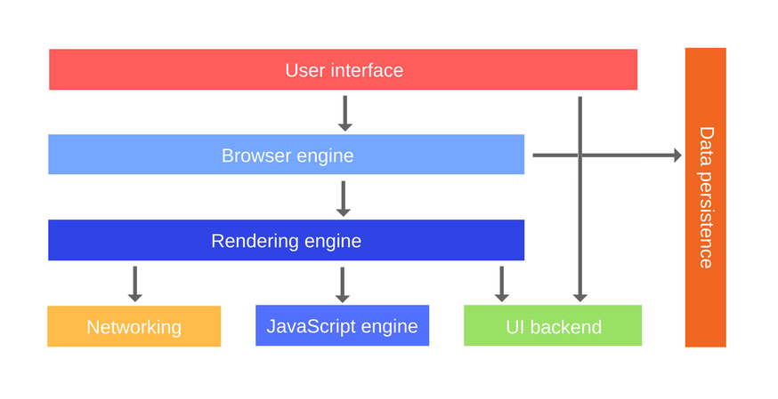
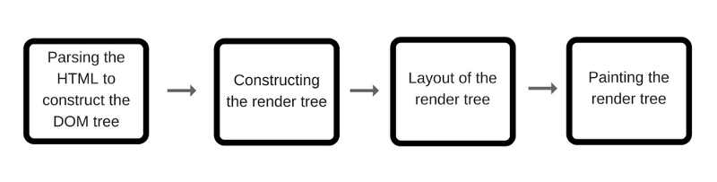

# How javascript work

## Contents

- [How javascript work](#how-javascript-work)
  - [Contents](#contents)
  - [브라우저 구성](#%EB%B8%8C%EB%9D%BC%EC%9A%B0%EC%A0%80-%EA%B5%AC%EC%84%B1)
  - [Node.js 구성](#nodejs-%EA%B5%AC%EC%84%B1)
  - [브라우저 엔진](#%EB%B8%8C%EB%9D%BC%EC%9A%B0%EC%A0%80-%EC%97%94%EC%A7%84)
    - [V8](#v8)
    - [hidden class](#hidden-class)
    - [인라인캐싱](#%EC%9D%B8%EB%9D%BC%EC%9D%B8%EC%BA%90%EC%8B%B1)
    - [가비지 콜렉터](#%EA%B0%80%EB%B9%84%EC%A7%80-%EC%BD%9C%EB%A0%89%ED%84%B0)
  - [이벤트 루프와 테스트 큐](#%EC%9D%B4%EB%B2%A4%ED%8A%B8-%EB%A3%A8%ED%94%84%EC%99%80-%ED%85%8C%EC%8A%A4%ED%8A%B8-%ED%81%90)
    - [Zero delays](#zero-delays)
    - [마이크로테스크](#%EB%A7%88%EC%9D%B4%ED%81%AC%EB%A1%9C%ED%85%8C%EC%8A%A4%ED%81%AC)
    - [Job Queue](#job-queue)
  - [브라우저의 주요 컴포넌트](#%EB%B8%8C%EB%9D%BC%EC%9A%B0%EC%A0%80%EC%9D%98-%EC%A3%BC%EC%9A%94-%EC%BB%B4%ED%8F%AC%EB%84%8C%ED%8A%B8)
  - [렌더링 엔진](#%EB%A0%8C%EB%8D%94%EB%A7%81-%EC%97%94%EC%A7%84)
  - [렌더링 과정](#%EB%A0%8C%EB%8D%94%EB%A7%81-%EA%B3%BC%EC%A0%95)
  - [참조](#%EC%B0%B8%EC%A1%B0)

## 브라우저 구성


- WebAPI : 비동기 호출(`setTimeout`, `XMLHttpRequest`)과 `DOM`과 같은 기능을 제공한다.
- 이벤트루프와 태스트큐 : 엔진 외부에 구현되어 있고 비동기 방식으로 동시성을 제공한다.
- javascript 엔진 : 메모리 힙과 콜스택으로 구성된다.

## Node.js 구성


- api 콜백을 LIBUV(node.js 비동기 IO 라이브러리)가 지원하는 이벤트 루프에서 처리한다.

## 브라우저 엔진


- Mozilla Firefox : Spidermonkey
- Microsoft Edge : Chakra / ChakraCore
- Apple Safari : JavaScriptCore
- Google 크롬, Node.js : V8

---

- 메모리힙과 콜스택으로 구성된다.
- 콜스택 : 함수를 호출 할 때 함수의 arguments 와 지역변수로 구성된 `스택 프레임`을 생성해서 스택에 쌓고 컴파일 시 실행된다.  
  스택은 stack overflow가 발생 할 수 있고 에러가 발생하면 stack trace(현재 스택 추적 `console.trace`)를 할 수 있다.
- 메모리 힙 : 동적으로 메모리를 할당해야 하는 경우는 구조화 되지 않은 공간인 Heap에 할당 되어 런타임에 실행 된다.(object, string)

### V8

- 속도를 높히기 위해 인터프린터 대신 JIT(just in time) 컴파일러를 구현해 놓아서 javascript 코드 실행 시에 byte코드나 중간코드를 구현하지 않고 기계코드로 직접 컴파일 한다.
- 두가지 컴파일러
  - full-codegen : 간단하고 빠른 컴파일러
  - Crankshaft : 복잡하고 최적화하는 컴파일러
- 내부적으로 여러 스레드를 사용한다.
  - 코드를 가져와 컴파일하고 실행하는 주 스레드.
  - 컴파일을 위한 스레드
  - 런타임에게 어떤 메소드에 시간을 많이 쓸지 알려주는 프로파일러 쓰레드
  - 가비지콜렉터를 다루는 스레드
- 코드를 실행하면 full-codegen가 바로 기계코드로 변환하고  
  프로파일러 스레드는 메소드에게 최적화 된 데이터들을 모은다.  
  Crankshaft는 다른 스레드에서 실행되며, 자바스크립트 추상 구문 트리를 Hydrogen 이라는 고수준 정적 단일 할당 (SSA) 표현 으로 변환하고 Hydrogen graph를 최적화 한다

### hidden class

- 자바스크립트는 동적타이핑 언어이다. 컴파일시 메모리 오프셋을 결정 할 수 없으며 코드를 실행 할 때(런타임) 상황에 따라서 데이터 타입이 정해진다.
- 이 같은 이유로 객체 프로퍼티를 접근 할 때 마다 사전 같은 구조에서 속성를 찾아야 하고 이를 위한 동적 탐색(dynamic lookup)을 하게 되는데 이 과정에서 구현 방식에 따라 비용이 달라진다.
- V8은 hidden class를 사용해서 프로퍼티의 오프셋을 가지고 값을 업데이트 하면서 dynamic lookup을 회피하고 있다.
- [동작과정](https://engineering.linecorp.com/ko/blog/v8-hidden-class/)
- 속성을 참조하는 순서에 따라 다른 히든클래스가 생성되기 때문에 같은 순서로 초기화 하는것이 좋다.
- 객체를 초기화 할 때 사용하는 모든 속성을 할당하는것이 좋다. 추가로 할 당하면 히든 클래스가 변하기 때문에

### 인라인캐싱

- 메소드가 호출 될 때마다 객체의 히든클래스를 찾아서 오프셋값을 계산해야하기 때문에 이것을 캐싱처리 한다.
- 두번의 호출에서 한 메소드에서 같은 객체에 접근했다면 그 객체의 히든클래스를 참조하는 것을 건너 뛰고 스스로 해당 메소드 객체 포인터 속성에 오프셋을 저장해 놓는다.
- 값을 접근하는 순서에 따라 히든클래스가 달라지기 때문에 캐싱을 사용하지 못하는 경우가 있다.

### 가비지 콜렉터

- 메모리 할당을 추적하고 할당된 메모리가 더이상 필요 없어졌을때 해제하는 작업을 한다.
- Reference-counting 알고리즘 : 아무도 참조하지 않는 오브젝트가 있다면 가비지 콜렉션을 수행한다. 인터넷 익스플로러 6, 7 에서 쓰임
- Reference-counting 알고리즘은 순환참조가 되면 (서로 값을 참조하고 있다면) 메모리 해제가 안되는 한계점이 있다.
- Mark-and-sweep 알고리즘 : 주기적으로 가비지 콜렉터는 오브젝트 집합의 roots에서 시작해 닿을 수 없는 오브젝트에 대해 수행한다. 순환참조의 한계점을 극복할 수 있다.
- [mozilla](https://developer.mozilla.org/ko/docs/Web/JavaScript/Memory_Management)

## 이벤트 루프와 테스트 큐

- 모든 비동기 함수는 콜백 함수를 태스크 큐에 추가한다.
- 이벤트 루프는 '현재 실행중인 태스크가 없을 때'(주로 호출 스택이 비워졌을 때) 태스크 큐의 첫 번째 태스크를 꺼내와 실행한다.
- [데모 코드](http://latentflip.com/loupe/?code=JC5vbignYnV0dG9uJywgJ2NsaWNrJywgZnVuY3Rpb24gb25DbGljaygpIHsKICAgIHNldFRpbWVvdXQoZnVuY3Rpb24gdGltZXIoKSB7CiAgICAgICAgY29uc29sZS5sb2coJ1lvdSBjbGlja2VkIHRoZSBidXR0b24hJyk7ICAgIAogICAgfSwgMjAwMCk7Cn0pOwoKY29uc29sZS5sb2coIkhpISIpOwoKc2V0VGltZW91dChmdW5jdGlvbiB0aW1lb3V0KCkgewogICAgY29uc29sZS5sb2coIkNsaWNrIHRoZSBidXR0b24hIik7Cn0sIDUwMDApOwoKY29uc29sZS5sb2coIldlbGNvbWUgdG8gbG91cGUuIik7!!!PGJ1dHRvbj5DbGljayBtZSE8L2J1dHRvbj4%3D)

```js
while(queue.waitForMessage()){
  queue.processNextMessage();
}
```

- A 콜백이 큐에서 제거되고 B 콜백이 실행 될때 B에서 에러가 발생하므로 A콜백에 있는 try-catch 문에 잡히지 않는다.

```js
$('.btn').click(function() { // (A)
    try {
        $.getJSON('/api/members', function (res) { // (B)
            // 에러 발생 코드
        });
    } catch (e) {
        console.log('Error : ' + e.message);
    }
});
```

- 태스크 큐 작업이 끝나는 시점에 랜더링이 되기 때문에 하나의 콜백 안에 랜더링이 변하는 로직을 넣으면 생각처럼 작동 하지 않는다.
- 태스크 큐에 `setTimeout`로 작업을 분리해서 넣거나 `setImmediate`이나 `nextTick` 으로 해결 할 수 있다.

```js
$('.btn').click(function() {
    showWaitingMessage();
    longTakingProcess();
    hideWaitingMessage();
    showResult();
});

$('.btn').click(function() {
    showWaitingMessage();
    setTimeout(function() {
        longTakingProcess();
        hideWaitingMessage();
        showResult();
    }, 0);
});
```

### Zero delays

- `setTimeout(fn, 0)` 은 실제로 주어지 시간 뒤에 함수를 실행 하지 않는다.
- `setTimeout`에 대한 특정 시간 제한을 지정 했더라도 대기중인 메시지의 모든 코드가 완료 될 때까지 대기해야 한다.

### 마이크로테스크

- 프로미스는 마이크로테스크로 등록 되는데 이는 일반 태스크큐 보다 높은 우선순위를 지닌 테스크이다.

### Job Queue

- es6에서 도입 됐으며 Promises 에서 쓰임. 마이크로테스크와는 별도의 개념.
- 함수 안에서 프로미스가 리졸브 됐다면 그 함수가 끝나자 마자 바로 실행 된다.
- 현재 call stack이 비워졌을때 job이 실행이 되고 다른 잡이 끼어들지 못한다
- [참조](https://flaviocopes.com/javascript-event-loop/#es6-job-queue)
- [참조](http://www.ecma-international.org/ecma-262/6.0/#sec-jobs-and-job-queues)

## 브라우저의 주요 컴포넌트



- 사용자 인터페이스 : 주소바, 뒤로/앞으로가기, 북마크 등 웹페이지 보는 윈도우 빼고 브라우저에 보이는 모든부분
- 부라우저 엔진 : 사용자 인터페이스와 렌더링 엔진 사이에 인터렉션
- 렌더링 엔진 : 웹페이지를 노출한다. html과 css를 파싱하고 파싱된 컨텐츠를 스크린에 노출함.
- 네크워킹 : XHR requests같은 네트워크 콜, 다양한 플랫폼을 위해 각다 다른 구현으로 만들어짐
- UI 백엔드 : 체크박스나 윈도우 같은 주요 위젯을 그리기 위해 사용됨. 특정 플랫폼에 국한 되지 않고 일반적인 인터페이스를 노출한다.
- javascript 엔진
- data persistence : 로컬스토리지, indexDB, webSQL, 파일 시스템 같이 로컬저장소 제공

## 렌더링 엔진

- Gecko — Firefox
- WebKit — Safari
- Blink — Chrome, Opera (from version 15 onwards)

## 렌더링 과정



1. DOM tree 생성
   - 렌더링 엔진은 html 문서를 파싱해 실제 돔 노드들로 변환해서 돔트리를 만든다
2. CSSSOM(CSS Object Model) tree 생성
    - DOM 트리를 만드는 중에 head에서 link 태그에서 css 파일을 만나게 되면 렌더링 엔진에게 css 변환이 필요하다고 요청한다.
    - css 속성들은 부모-자식간에 속성이 상속되기 때문에 트리구조로 관계를 설정해 각 노드의 스타일을 트리에서 재귀적으로 계산한다.
3. 렌더 트리 생성
   - 랜더 트리는 노출되는 순서대로 시각적 정보들을 만들어낸다.
   - 돔 트리의 루트 노드부터 실제 노출되는 트리 만 순회 하면서 CSSOM과 매치해 계산된 스타일과 함께 노출 될 노드를 방출한다.(`display:none`,`<script>`, `<meta>` 태그는 무시)
4. 렌더트리 레이아웃
    - 각 랜더러(노드와 계산된 스타일을 가지고 있는 오브젝트)의 위치와 크기를 계산한다.
    - 루트 렌더러(`<html>`) 좌표를 기준으로 재귀적으로 좌표값을 계산한다.
5. 렌더트리 페인팅
    - 렌더러의 `paint()` 메서드 호출
    - 페인팅은 Global(전체 트리를 다시 그림)과 Incremental(특정 랜더러만 다시그림)가 있다
    - 페인팅 중에 나머지 콘텐츠를 네트워크에서 계속 받아오고 파싱하면서 동시에 페인팅을 진행 한다.
6. 스크립트 파싱
    - `<script>` 태그를 만다면 파서는 스크립트 파싱과 스크립트 실행을 하며 파서는 작업이 끝날때 까지 대기 한다. HTML5에서는 비동기로 다른 스레드에서 스크립트 파싱과 실행을 할 수 있는 옵션을 추가 함.


## 참조


- How JavaScript works 시리즈
  1. *DONE* [How JavaScript works: an overview of the engine, the runtime, and the call stack](https://blog.sessionstack.com/how-does-javascript-actually-work-part-1-b0bacc073cf)
  2. *DONE* [How JavaScript works: inside the V8 engine + 5 tips on how to write optimized code](https://blog.sessionstack.com/how-javascript-works-inside-the-v8-engine-5-tips-on-how-to-write-optimized-code-ac089e62b12e)
  3. [How JavaScript works: memory management + how to handle 4 common memory leaks](https://blog.sessionstack.com/how-javascript-works-memory-management-how-to-handle-4-common-memory-leaks-3f28b94cfbec)
  4. *DONE* [How JavaScript works: Event loop and the rise of Async programming + 5 ways to better coding with async/await](https://blog.sessionstack.com/how-javascript-works-event-loop-and-the-rise-of-async-programming-5-ways-to-better-coding-with-2f077c4438b5)
  5. [How JavaScript works: Deep dive into WebSockets and HTTP/2 with SSE + how to pick the right path](https://blog.sessionstack.com/how-javascript-works-deep-dive-into-websockets-and-http-2-with-sse-how-to-pick-the-right-path-584e6b8e3bf7)
  6. [How JavaScript works: A comparison with WebAssembly + why in certain cases it’s better to use it over JavaScript](https://blog.sessionstack.com/how-javascript-works-a-comparison-with-webassembly-why-in-certain-cases-its-better-to-use-it-d80945172d79)
  7. [How JavaScript works: The building blocks of Web Workers + 5 cases when you should use them](https://blog.sessionstack.com/how-javascript-works-the-building-blocks-of-web-workers-5-cases-when-you-should-use-them-a547c0757f6a)
  8. [How JavaScript works: Service Workers, their lifecycle and use cases](https://blog.sessionstack.com/how-javascript-works-service-workers-their-life-cycle-and-use-cases-52b19ad98b58)
  9. [How JavaScript works: the mechanics of Web Push Notifications](https://blog.sessionstack.com/how-javascript-works-the-mechanics-of-web-push-notifications-290176c5c55d)
  10. [How JavaScript works: tracking changes in the DOM using MutationObserver](https://blog.sessionstack.com/how-javascript-works-tracking-changes-in-the-dom-using-mutationobserver-86adc7446401)
  11. *IMG* [How JavaScript works: the rendering engine and tips to optimize its performance](https://blog.sessionstack.com/how-javascript-works-the-rendering-engine-and-tips-to-optimize-its-performance-7b95553baeda)
  12. [How JavaScript Works: Inside the Networking Layer + How to Optimize Its Performance and Security](https://blog.sessionstack.com/how-javascript-works-inside-the-networking-layer-how-to-optimize-its-performance-and-security-f71b7414d34c)
  13. [How JavaScript works: Under the hood of CSS and JS animations + how to optimize their performance](https://blog.sessionstack.com/how-javascript-works-under-the-hood-of-css-and-js-animations-how-to-optimize-their-performance-db0e79586216)
  14. [How JavaScript works: Parsing, Abstract Syntax Trees (ASTs) + 5 tips on how to minimize parse time](https://blog.sessionstack.com/how-javascript-works-parsing-abstract-syntax-trees-asts-5-tips-on-how-to-minimize-parse-time-abfcf7e8a0c8)
  15. [How JavaScript works: The internals of classes and inheritance + transpiling in Babel and TypeScript](https://blog.sessionstack.com/how-javascript-works-the-internals-of-classes-and-inheritance-transpiling-in-babel-and-113612cdc220)
  16. [How JavaScript works: Storage engines + how to choose the proper storage API](https://blog.sessionstack.com/how-javascript-works-storage-engines-how-to-choose-the-proper-storage-api-da50879ef576)
  17. [How JavaScript works: the internals of Shadow DOM + how to build self-contained components](https://blog.sessionstack.com/how-javascript-works-the-internals-of-shadow-dom-how-to-build-self-contained-components-244331c4de6e)
  18. [How JavaScript works: WebRTC and the mechanics of peer to peer networking](https://blog.sessionstack.com/how-javascript-works-webrtc-and-the-mechanics-of-peer-to-peer-connectivity-87cc56c1d0ab)
  19. [How JavaScript works: Under the hood of custom elements + Best practices on building reusable components](https://blog.sessionstack.com/how-javascript-works-under-the-hood-of-custom-elements-best-practices-on-building-reusable-e118e888de0c)

---

- [MDN web docs](https://developer.mozilla.org/en-US/docs/Web/JavaScript/EventLoop)
- [toast meetup](https://meetup.toast.com/posts/89)