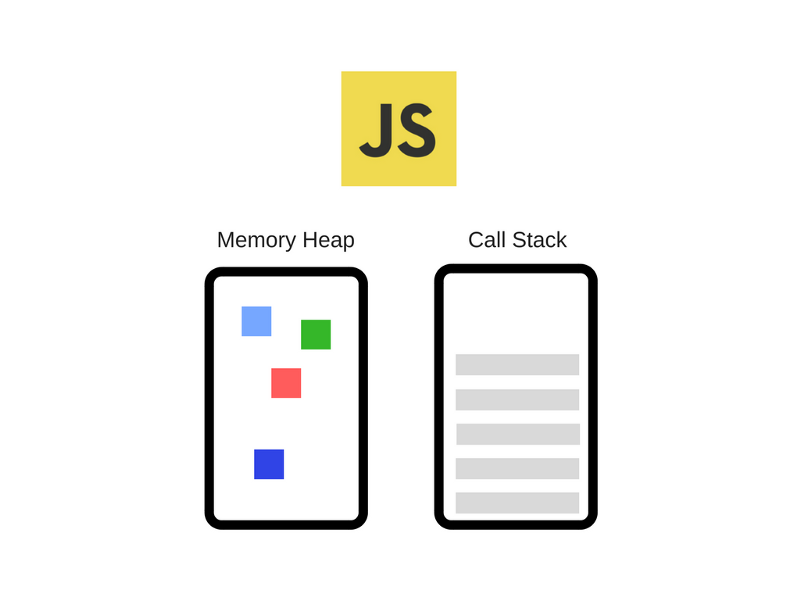

# How javascript work

## Contents

- [How javascript work](#how-javascript-work)
  - [Contents](#contents)
  - [브라우저 구성](#%EB%B8%8C%EB%9D%BC%EC%9A%B0%EC%A0%80-%EA%B5%AC%EC%84%B1)
  - [Node.js 구성](#nodejs-%EA%B5%AC%EC%84%B1)
  - [브라우저 엔진](#%EB%B8%8C%EB%9D%BC%EC%9A%B0%EC%A0%80-%EC%97%94%EC%A7%84)
    - [V8](#v8)
    - [hidden class](#hidden-class)
    - [인라인캐싱](#%EC%9D%B8%EB%9D%BC%EC%9D%B8%EC%BA%90%EC%8B%B1)
    - [가비지 콜렉터](#%EA%B0%80%EB%B9%84%EC%A7%80-%EC%BD%9C%EB%A0%89%ED%84%B0)
  - [이벤트 루프와 테스트 큐](#%EC%9D%B4%EB%B2%A4%ED%8A%B8-%EB%A3%A8%ED%94%84%EC%99%80-%ED%85%8C%EC%8A%A4%ED%8A%B8-%ED%81%90)
    - [Zero delays](#zero-delays)
    - [마이크로테스크](#%EB%A7%88%EC%9D%B4%ED%81%AC%EB%A1%9C%ED%85%8C%EC%8A%A4%ED%81%AC)
  - [참조](#%EC%B0%B8%EC%A1%B0)

## 브라우저 구성


- WebAPI : 비동기 호출(`setTimeout`, `XMLHttpRequest`)과 `DOM`과 같은 기능을 제공한다.
- 이벤트루프와 태스트큐 : 엔진 외부에 구현되어 있고 비동기 방식으로 동시성을 제공한다.
- javascript 엔진 : 메모리 힙과 콜스택으로 구성된다.

## Node.js 구성


- api 콜백을 LIBUV(node.js 비동기 IO 라이브러리)가 지원하는 이벤트 루프에서 처리한다.

## 브라우저 엔진



- Mozilla Firefox : Spidermonkey
- Microsoft Edge : Chakra / ChakraCore
- Apple Safari : JavaScriptCore
- Google 크롬, Node.js : V8

---

- 메모리힙과 콜스택으로 구성된다.
- 콜스택 : 함수를 호출 할 때 함수의 arguments 와 지역변수로 구성된 `스택 프레임`을 생성해서 스택에 쌓고 컴파일 시 실행된다.  
  스택은 stack overflow가 발생 할 수 있고 에러가 발생하면 stack trace(현재 스택 추적 `console.trace`)를 할 수 있다.
- 메모리 힙 : 동적으로 메모리를 할당해야 하는 경우는 구조화 되지 않은 공간인 Heap에 할당 되어 런타임에 실행 된다.(object, string)

### V8

- 속도를 높히기 위해 인터프린터 대신 JIT(just in time) 컴파일러를 구현해 놓아서 javascript 코드 실행 시에 byte코드나 중간코드를 구현하지 않고 기계코드로 직접 컴파일 한다.
- 두가지 컴파일러
  - full-codegen : 간단하고 빠른 컴파일러
  - Crankshaft : 복잡하고 최적화하는 컴파일러
- 내부적으로 여러 스레드를 사용한다.
  - 코드를 가져와 컴파일하고 실행하는 주 스레드.
  - 컴파일을 위한 스레드
  - 런타임에게 어떤 메소드에 시간을 많이 쓸지 알려주는 프로파일러 쓰레드
  - 가비지콜렉터를 다루는 스레드
- 코드를 실행하면 full-codegen가 바로 기계코드로 변환하고  
  프로파일러 스레드는 메소드에게 최적화 된 데이터들을 모은다.  
  Crankshaft는 다른 스레드에서 실행되며, 자바스크립트 추상 구문 트리를 Hydrogen 이라는 고수준 정적 단일 할당 (SSA) 표현 으로 변환하고 Hydrogen graph를 최적화 한다

### hidden class

- 자바스크립트는 동적타이핑 언어이다. 컴파일시 메모리 오프셋을 결정 할 수 없으며 코드를 실행 할 때(런타임) 상황에 따라서 데이터 타입이 정해진다.
- 이 같은 이유로 객체 프로퍼티를 접근 할 때 마다 사전 같은 구조에서 속성를 찾아야 하고 이를 위한 동적 탐색(dynamic lookup)을 하게 되는데 이 과정에서 구현 방식에 따라 비용이 달라진다.
- V8은 hidden class를 사용해서 프로퍼티의 오프셋을 가지고 값을 업데이트 하면서 dynamic lookup을 회피하고 있다.
- [동작과정](https://engineering.linecorp.com/ko/blog/v8-hidden-class/)
- 속성을 참조하는 순서에 따라 다른 히든클래스가 생성되기 때문에 같은 순서로 초기화 하는것이 좋다.
- 객체를 초기화 할 때 사용하는 모든 속성을 할당하는것이 좋다. 추가로 할 당하면 히든 클래스가 변하기 때문에

### 인라인캐싱

- 메소드가 호출 될 때마다 객체의 히든클래스를 찾아서 오프셋값을 계산해야하기 때문에 이것을 캐싱처리 한다.
- 두번의 호출에서 한 메소드에서 같은 객체에 접근했다면 그 객체의 히든클래스를 참조하는 것을 건너 뛰고 스스로 해당 메소드 객체 포인터 속성에 오프셋을 저장해 놓는다.
- 값을 접근하는 순서에 따라 히든클래스가 달라지기 때문에 캐싱을 사용하지 못하는 경우가 있다.

### 가비지 콜렉터

- 메모리 할당을 추적하고 할당된 메모리가 더이상 필요 없어졌을때 해제하는 작업을 한다.
- Reference-counting 알고리즘 : 아무도 참조하지 않는 오브젝트가 있다면 가비지 콜렉션을 수행한다. 인터넷 익스플로러 6, 7 에서 쓰임
- Reference-counting 알고리즘은 순환참조가 되면 (서로 값을 참조하고 있다면) 메모리 해제가 안되는 한계점이 있다.
- Mark-and-sweep 알고리즘 : 주기적으로 가비지 콜렉터는 오브젝트 집합의 roots에서 시작해 닿을 수 없는 오브젝트에 대해 수행한다. 순환참조의 한계점을 극복할 수 있다.
- [mozilla](https://developer.mozilla.org/ko/docs/Web/JavaScript/Memory_Management)

## 이벤트 루프와 테스트 큐

- 모든 비동기 함수는 콜백 함수를 태스크 큐에 추가한다.
- 이벤트 루프는 '현재 실행중인 태스크가 없을 때'(주로 호출 스택이 비워졌을 때) 태스크 큐의 첫 번째 태스크를 꺼내와 실행한다.
- [데모 코드](http://latentflip.com/loupe/?code=JC5vbignYnV0dG9uJywgJ2NsaWNrJywgZnVuY3Rpb24gb25DbGljaygpIHsKICAgIHNldFRpbWVvdXQoZnVuY3Rpb24gdGltZXIoKSB7CiAgICAgICAgY29uc29sZS5sb2coJ1lvdSBjbGlja2VkIHRoZSBidXR0b24hJyk7ICAgIAogICAgfSwgMjAwMCk7Cn0pOwoKY29uc29sZS5sb2coIkhpISIpOwoKc2V0VGltZW91dChmdW5jdGlvbiB0aW1lb3V0KCkgewogICAgY29uc29sZS5sb2coIkNsaWNrIHRoZSBidXR0b24hIik7Cn0sIDUwMDApOwoKY29uc29sZS5sb2coIldlbGNvbWUgdG8gbG91cGUuIik7!!!PGJ1dHRvbj5DbGljayBtZSE8L2J1dHRvbj4%3D)

```js
while(queue.waitForMessage()){
  queue.processNextMessage();
}
```

- A 콜백이 큐에서 제거되고 B 콜백이 실행 될때 B에서 에러가 발생하므로 A콜백에 있는 try-catch 문에 잡히지 않는다.

```js
$('.btn').click(function() { // (A)
    try {
        $.getJSON('/api/members', function (res) { // (B)
            // 에러 발생 코드
        });
    } catch (e) {
        console.log('Error : ' + e.message);
    }
});
```

- 태스크 큐 작업이 끝나는 시점에 랜더링이 되기 때문에 하나의 콜백 안에 랜더링이 변하는 로직을 넣으면 생각처럼 작동 하지 않는다.
- 태스크 큐에 `setTimeout`로 작업을 분리해서 넣거나 `setImmediate`이나 `nextTick` 으로 해결 할 수 있다.

```js
$('.btn').click(function() {
    showWaitingMessage();
    longTakingProcess();
    hideWaitingMessage();
    showResult();
});

$('.btn').click(function() {
    showWaitingMessage();
    setTimeout(function() {
        longTakingProcess();
        hideWaitingMessage();
        showResult();
    }, 0);
});
```

### Zero delays

- `setTimeout(fn, 0)` 은 실제로 주어지 시간 뒤에 함수를 실행 하지 않는다.
- `setTimeout`에 대한 특정 시간 제한을 지정 했더라도 대기중인 메시지의 모든 코드가 완료 될 때까지 대기해야 한다.

### 마이크로테스크

- 프로미스는 마이크로테스크로 등록 되는데 이는 일반 태스크큐 보다 높은 우선순위를 같는 테스크이다.

## 참조

- [MDN web docs](https://developer.mozilla.org/en-US/docs/Web/JavaScript/EventLoop)
- [How JavaScript works: inside the V8 engine + 5 tips on how to write optimized code](https://blog.sessionstack.com/how-javascript-works-inside-the-v8-engine-5-tips-on-how-to-write-optimized-code-ac089e62b12e)
- [How JavaScript works: an overview of the engine, the runtime, and the call stack](https://blog.sessionstack.com/how-does-javascript-actually-work-part-1-b0bacc073cf)
- [How JavaScript works: Event loop and the rise of Async programming + 5 ways to better coding with async/await](https://blog.sessionstack.com/how-javascript-works-event-loop-and-the-rise-of-async-programming-5-ways-to-better-coding-with-2f077c4438b5)
- [toast meetup](https://meetup.toast.com/posts/89)